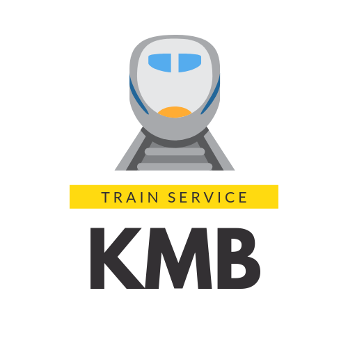
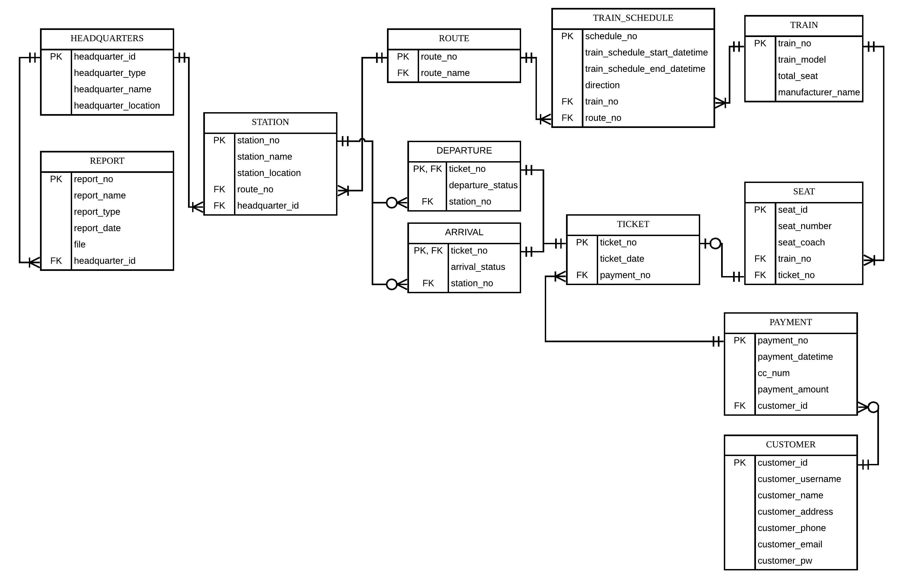

# HOLY KMB Train Database

## Introduction

A **train system database** made using Oracle SQL RDBMS (Relational Database Management System).

A joint effort of 4 students in TARUC. For educational purpose only.

## Table of Contents :bookmark_tabs:

[TOC]

## Project Objectives :o:

- To put in practice of the Oracle RDBMS knowledge that we learned.
- To learn how to develop a functional database for enterprise use
- To understand the significance of database in software and companies.

## Design Specifications :page_facing_up:

### Database

- 3rd Normalized Form
- **12 tables**, as stated in the following ERD, in the `tables` folder.

### Data Records

- Sample data records provided in the `data-records` folder. 
- The order of insertion has to follow the numbering on the files due to primary key and foreign key relationships.

### Views

- Mainly consists of preprogrammed reporting tools/queries
- Supports limited customization of queries
- `SQL*Plus` is required for full functionality and formatting. Other Oracle SQL tools such as `SQLcl` or `SQL Developer` supports user input, but do not support formatting.
- **3 views** are located inside the repository, the rest are not made public.

#### Incident Reporting View

**The purpose of this query is to allow the management to handle incidents and**
**accidents on a train station.** 

- By performing the query, the management will be able to see all
  the customers who had a booking towards a certain station as well as their contact information.
- During train station damages &amp; emergencies the passengers in-route needs to be notified of such incidents. 
- KMB will be able to quickly contact all passengers likely to be affected by accidents, to inform them of any critical situations.
- Passengers will then be able to avoid such incidents until all incidents settle down.

#### Monthly Ridership View

- The purpose of this query is to understand the general health of KMB by providing information on the trend of ridership in KMB in the 1 month.

#### Train Maintenance View

- The purpose of this query is to quickly find the trains that require maintenance.
- In KMB, trains are important assets and they must be serviced regularly.

## Installation & Usage :wrench:

### Software Required

- Oracle Database software, at least version 11g.
- SQL*Plus installed, configured correctly.

### Installation

- Using SQL*Plus/SQLcl/SQL Developer, navigate to the `holy-kmb-db\tables` folder
- Execute `start holy_kmb_db.sql` to create all the relevant tables. The database is now fully formed.
- OPTIONAL. Insert all the sample data inside the `data-records`. Navigate into the `data-records` folder and `start fileName` where `fileName` are all the individual files. *Insert them in the numeric order present on the file names.*

### Using the Views for Reporting

- Using SQL*Plus, navigate into the `holy-kmb-db\views`
- Execute `start viewName` where `viewName` is one of the views present in the folder.

## Uninstallation :heavy_multiplication_x:

:warning: This will permanently erase ALL data and tables, unless you are very sure or have made a backup, do not attempt the following.

- Using SQL*Plus, navigate into the `holy-kmb-db\others`
- Execute `start drop_all_tables.sql`

